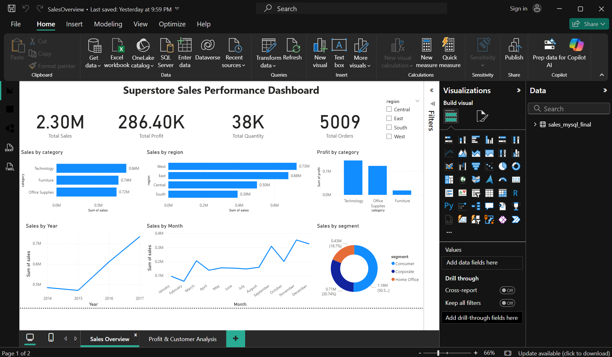
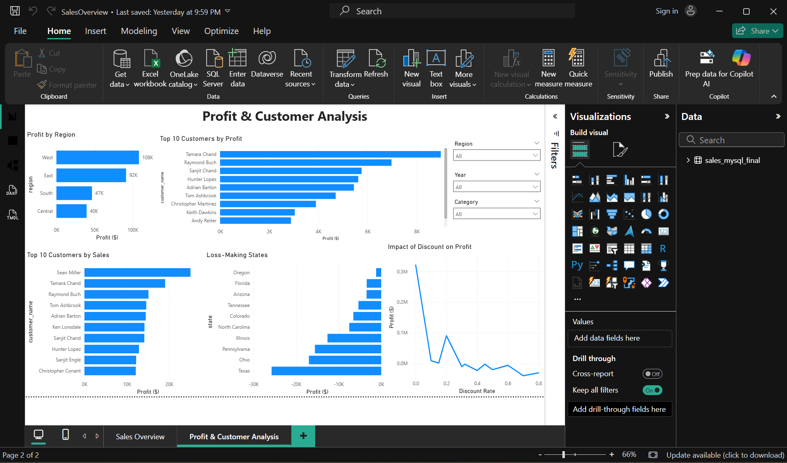

# Superstore Sales Analysis

## Project Overview

This project analyzes Superstore sales data to identify sales trends, profitability, customer performance, regional performance, and the impact of discounts.

The analysis was completed using Python, MySQL, and Power BI to demonstrate an end-to-end data analytics workflow.

## Tools Used

- Python (Pandas, NumPy, Matplotlib)
- MySQL
- Power BI
- Excel

## Project Objectives

The main objectives of this project are:

- Analyze overall sales and profit performance.
- Identify the most profitable categories and regions.
- Find top-performing customers and products.
- Identify loss-making states and products.
- Analyze the relationship between discounts and profit.
- Examine yearly and monthly sales trends.
- Build an interactive Power BI dashboard to present key business insights.

## Dataset

The project uses the Sample Superstore dataset, which contains sales transaction data including:

- Order and shipping information
- Customer and segment details
- Product categories and sub-categories
- Sales, quantity, discount, and profit
- Geographic information such as region, state, and city

The dataset contains approximately 10,000 transaction records covering the years 2014–2017.

## Python Data Analysis

Python was used for data exploration, cleaning, and analysis using Pandas, NumPy, and Matplotlib.

Key analysis included:

- Checking and preparing the dataset for analysis.
- Analyzing total sales and profit.
- Comparing sales and profit across categories and regions.
- Identifying top-selling and loss-making products.
- Analyzing customer and segment performance.
- Examining the relationship between discount and profitability.
- Analyzing yearly and monthly sales trends.
- Creating visualizations to understand business performance.

## SQL Analysis

MySQL was used to perform business-focused analysis on the Superstore dataset.

Key SQL analysis included:

- Calculating total sales, profit, orders, and customers.
- Calculating profit margin and average order value.
- Analyzing sales and profit by category and region.
- Identifying the top-performing products.
- Finding the top customers by sales and profit.
- Identifying loss-making states and products.
- Analyzing customer segments.
- Examining discount levels and their impact on profitability.
- Analyzing yearly sales and profit trends.

## Power BI Dashboard

An interactive Power BI dashboard was created to present the results of the analysis.

The dashboard contains two pages:

### Sales Overview
- Total Sales
- Total Profit
- Total Quantity
- Total Orders
- Sales by Category
- Sales by Region
- Profit by Category
- Sales by Year
- Sales by Month
- Sales by Segment

### Profit & Customer Analysis
- Profit by Region
- Top 10 Customers by Sales
- Top 10 Customers by Profit
- Loss-Making States
- Impact of Discount on Profit
- Interactive Region, Category, and Year filters

## Dashboard Preview

### Sales Overview

### Profit & Customer Analysis

## Key Business Insights

- Total sales reached approximately $2.30M with $286.40K in profit.
- Technology generated the highest profit among the product categories.
- The West region was the strongest region for both sales and profit.
- Consumer was the largest customer segment by sales.
- Sales increased strongly from 2015 to 2017, with 2017 recording the highest annual sales.
- Sales were generally stronger toward the end of the year.
- Several states generated losses, with Texas showing the largest overall loss.
- Higher discount levels were associated with declining profitability.
- The highest-sales customers were not always the highest-profit customers.
- Some individual products generated significant losses despite strong overall company profitability.

## Business Recommendations

Based on the analysis:

- Reduce or carefully control high discount levels because heavy discounts are associated with lower profitability.
- Review loss-making products and states to identify pricing, cost, and operational issues.
- Focus marketing and inventory planning on the stronger September–December sales period.
- Continue investing in Technology and other high-profit areas.
- Study successful strategies in the West region and determine whether they can be applied to other regions.
- Focus on customer profitability in addition to sales when identifying valuable customers.

## Project Structure

Project1/
├── data/       - Dataset used for the analysis
├── Python/     - Python/Jupyter Notebook analysis
├── sql/        - MySQL analysis queries
├── PowerBI/    - Power BI dashboard file
├── image/      - Dashboard screenshots
└── README.md   - Project documentation

## Conclusion

This project demonstrates an end-to-end data analytics workflow using Python, SQL, and Power BI. The analysis transforms raw sales data into meaningful business insights and recommendations that can support data-driven decision-making.